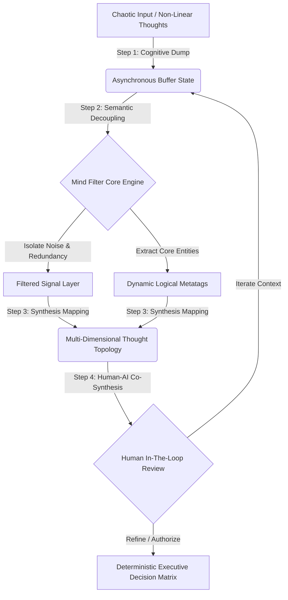

# Thought-Synthesis-App (Mind Filter): Cognitive Noise-Reduction Engine

A human-centric cognitive optimization application designed to solve a pervasive enterprise pain point: management demanding aggressive execution velocity while knowledge workers experience severe cognitive overwhelm and context fragmentation. Mind Filter bridges the human-AI context gap by transforming chaotic daily operations, non-linear thoughts, and unstructured data streams into deterministic, executive-ready thought matrices.

---

## 🏛️ Executive Summary

Traditional knowledge management systems rely on rigid hierarchical folder structures or frictionless feeds, both of which accelerate mental fatigue and introduce semantic noise. 

This repository houses the architecture for the **Thought-Synthesis Engine (Mind Filter)**—a production-ready frontend framework that acts as a cognitive filter layer. By decoupling raw, unorganized inputs from formalized outputs, the engine allows executives and domain experts to dump non-linear thoughts into a decoupled state, applies real-time semantic categorization, and leverages structured logic to synthesize messy data into highly scannable, actionable decision paths.

---

## 🧠 Cognitive Workflow & System Architecture

The application focuses on cognitive ergonomics, ensuring that data filtering is non-intrusive. The system ingests raw entropy, structures it asynchronously into distinct logical tags, and builds an intuitive relational mesh for human verification.

# 🛠️ Core Architectural Pillars

## Pillar 1: Cognitive Friction Reduction (Non-Linear Ingestion)
**The Invariant:**  
Human intelligence does not operate in rigid tables; pushing structure onto active thinking kills strategic intent.  

**Mechanism:**  
- Provides an unconstrained, zero-latency buffer layer for text and voice-to-text ingestion.  
- The system intentionally postpones structure until the raw intention is fully captured.  
- Shields the user from operational friction during high-stress problem solving.  

---

## Pillar 2: Asynchronous Mind Filtering (Semantic Decoupling)
**The Invariant:**  
More data does not equate to better execution; context requires aggressive data pruning.  

**Mechanism:**  
- Implements a localized processing engine that acts as a relational schema.  
- Scans incoming text to separate signal from noise.  
- Strips conversational padding and replicates the filtering capacity of an elite operations chief—isolating the "core facts" from the surrounding clutter.  

---

## Pillar 3: Human-AI Co-Synthesis (The Intent Anchor)
**The Invariant:**  
AI should never generate autonomous outcomes without explicit human contextual anchoring.  

**Mechanism:**  
- Avoids creating automated black-box outputs.  
- Translates raw data into scannable structural blocks.  
- Presents the user with an intuitive, multi-dimensional conceptual grid.  
- Keeps the human expert as the ultimate arbiter, validating logical links and approving finalized data transformations.  

---

# 🎯 Target Audience & Strategic Alignment
- **Operations Directors & Project Leads:** Tools to convert fragmented team updates into clear, high-level project milestones.  
- **Change Management Leads:** A framework designed around cognitive ergonomics to accelerate software adoption without causing digital fatigue.  
- **Product Managers & UX Architects:** A design blueprint showing how to successfully introduce advanced AI utilities while maintaining a strictly human-centric control layer.  

---

# 🔖 Topics
`#cognitive-computing` `#human-centric-design` `#knowledge-management`  
`#ux-architecture` `#thought-synthesis` `#cognitive-ergonomics` `#digital-transformation`

---

📌 *This document was structured with the help of AI, and curated by Sana.M.*
