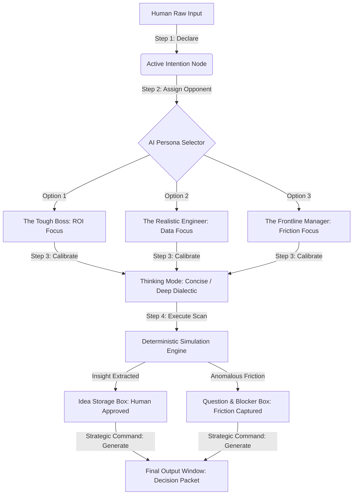

# Mind Filter AI — Thought Synthesis Platform
> **An Interactive Governance Sandbox for Dialectic Ideation**

This repository contains the interactive source code for **Mind Filter AI**, a web-based conceptual prototyping environment designed to filter, stress-test, and synthesize human cognitive input. By replacing unpredictable, probabilistic AI chat mechanisms with a deterministic, structured, and friction-controlled framework, this sandbox translates chaotic operational intent into decision-ready executive packets.

This project showcases how senior enterprise expertise and human-centric design govern the ideation loop before engaging heavy automation infrastructure.

---

## 🏗️ Core Architecture & Logical Flow

The platform operates on a structured, multi-stage human-in-the-loop dialectic process. It dynamically anchors risks, flags conceptual friction, and formats raw input into systemic logic.

🛠️ Key Sandbox Features
Intent-Based Alignment: Forces the user to establish a precise operational boundary (Active Intention) before triggering downstream compute power.
Dialectic Persona Stress-Testing: Simulates enterprise constraint matrices by routing human ideas through adversarial roles (Financial ROI, Technical Legacy Constraints, or Frontline Operational Friction).
Dual-Track Friction Anchoring: Implements the core concept of Calculated Friction by isolating positive validated outcomes into the Idea Storage Box while gracefully trapping operational dependencies in the Question & Blocker Box.
Deterministic Synthesis Matrix: Compiles scattered conversational data into an auditable, high-contrast, text-based strategic presentation packet on human command.
💻 Tech Stack & Zero-Dependency Execution
To preserve total local sovereignty, minimize API token burn, and maintain zero lag, this sandbox is engineered with zero server-side compilation requirements:
Frontend: Semantic HTML5 and Tailwind CSS via highly optimized runtime CDN.
Component Kit: FontAwesome v6.4.0 asynchronous icon sets.
Core Engine: Vanilla JavaScript deterministic state machine driving a 6-stage structured dialogue pipeline.
🚀 Quick Start
Download or clone the index.html file from this repository.
Open the file directly in any modern enterprise web browser (Chrome, Safari, Edge, Firefox). No installation, node modules, or API keys required.
⚖️ Disclaimer
This interactive sandbox is a conceptual design prototype developed for theoretical and educational purposes. It does not connect to external third-party Large Language Model APIs. All simulated algorithmic responses, friction logs, and metrics are modeled via local client-side state trees to demonstrate interface logic, operational constraints, and human-centric governance workflows.
This document was structured with the help of AI, and curated by Sana.M.
